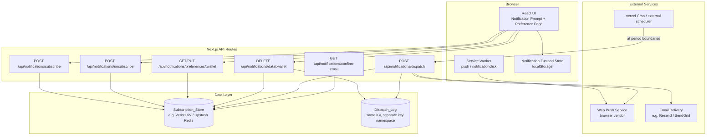

# Design Document: Wrap Period Notifications

## Overview

This feature adds an opt-in notification system to Stellar Wrapped, alerting users when a new wrap period (weekly, monthly, or yearly) becomes available. It is a greenfield addition: the app currently has no notification infrastructure, no backend subscription store, and no service worker.

The design introduces:
- A **service worker** for Web Push notification receipt
- A **Next.js API layer** for subscription management and scheduled dispatch
- A **Zustand-based notification preferences store** with localStorage-backed persistence
- A **/notifications** preferences page accessible from the Navbar
- A **post-wrap prompt** shown after the user's first wrap view
- GDPR-compliant consent gates and one-click email unsubscription via tokens

The implementation is deliberately scoped to what can be shipped as a Next.js-native feature with minimal external dependencies. The scheduled dispatch job is designed to run as a Vercel Cron Job (or equivalent) calling an internal API route.

---

## Architecture



### Key Design Decisions

**No full backend server**: All server logic runs as Next.js API Routes, keeping the stack consistent and deployable on Vercel without an additional service.

**Vercel KV (Upstash Redis) as Subscription_Store**: Provides durable, wallet-keyed storage without requiring a relational DB. Keys use the pattern `notif:sub:{walletAddress}` and `notif:log:{walletAddress}:{channel}:{period}:{periodKey}`.

**Web Push via VAPID**: Standard browser Push API. VAPID key pair generated once and stored as environment variables. The `web-push` npm library handles VAPID signing.

**Email via Resend** (configurable): Minimal integration—send a single transactional email. The `NEXT_PUBLIC_EMAIL_ENABLED` flag controls whether email is shown in the UI at all, so operators who skip email setup are not affected.

**Service worker as a static file**: Placed at `public/sw.js` (compiled at build time from `src/sw/service-worker.ts` using a small esbuild step), registered from a `useServiceWorker` hook.

**Scheduled dispatch via Vercel Cron**: A `vercel.json` cron entry calls `/api/notifications/dispatch` at the relevant boundaries (hourly check; dispatch logic determines which periods have ticked over).

---

## Components and Interfaces

### 1. Service Worker (`public/sw.js`)

Handles `push` and `notificationclick` events.

```typescript
// Push event handler
self.addEventListener('push', (event: PushEvent) => {
  const data = event.data?.json() as PushPayload;
  event.waitUntil(
    self.registration.showNotification(data.title, {
      body: data.body,
      icon: data.icon,
      data: { url: data.actionUrl },
    })
  );
});

// Click handler
self.addEventListener('notificationclick', (event: NotificationEvent) => {
  event.notification.close();
  event.waitUntil(clients.openWindow(event.notification.data.url));
});
```

**PushPayload type** (shared between service worker and dispatch API):
```typescript
interface PushPayload {
  title: string;        // e.g. "Stellar Wrapped is ready! 🎉"
  body: string;         // e.g. "Your Monthly wrap is ready. See what happened!"
  icon: string;         // "/icon-192.png"
  actionUrl: string;    // "/connect?period=monthly"
}
```

### 2. `useServiceWorker` Hook (`app/hooks/useServiceWorker.ts`)

Responsible for:
- Detecting Push API support
- Registering the service worker
- Requesting and managing push subscriptions

```typescript
interface UseServiceWorkerReturn {
  isSupported: boolean;                // SW + Push both available
  permissionState: NotificationPermission | null;
  pushSubscription: PushSubscription | null;
  subscribe: () => Promise<void>;      // requests permission, creates PushSubscription
  unsubscribe: () => Promise<void>;
}
```

### 3. Notification Preferences Store (`app/store/notificationStore.ts`)

Zustand store with `persist` middleware backed by localStorage, mirroring the existing pattern in `wrapStore.ts`.

```typescript
interface NotificationPreferences {
  walletAddress: string | null;
  pushEnabled: boolean;
  emailEnabled: boolean;
  email: string | null;
  emailStatus: 'inactive' | 'pending' | 'active';
  periods: {
    push: { weekly: boolean; monthly: boolean; yearly: boolean };
    email: { weekly: boolean; monthly: boolean; yearly: boolean };
  };
  permissionDenied: boolean;          // localStorage flag for denied push
  consentGiven: boolean;              // GDPR consent flag
  syncStatus: 'idle' | 'syncing' | 'error' | 'synced';
  lastKnownRemoteState: Partial<NotificationPreferences> | null;
}
```

### 4. API Routes

#### `POST /api/notifications/subscribe`
Accepts a push subscription object and wallet address; stores in KV.

Request body:
```typescript
{ walletAddress: string; subscription: PushSubscriptionJSON; periods: PeriodSelection }
```

#### `GET /api/notifications/preferences/:wallet`
Returns current preferences for a wallet address.

#### `PUT /api/notifications/preferences/:wallet`
Updates periods, email, or push channel settings.

#### `POST /api/notifications/subscribe-email`
Accepts email + wallet + periods; writes a pending subscription; sends confirmation email.

#### `GET /api/notifications/confirm-email?token=...`
Activates a pending email subscription by matching the token.

#### `POST /api/notifications/unsubscribe`
Removes push or email subscription. For email, accepts `token` (unsubscribe link) or `walletAddress` (preference page).

#### `DELETE /api/notifications/data/:wallet`
Deletes all stored data for a wallet (GDPR erasure). Marks deletion and schedules confirmation email.

#### `POST /api/notifications/dispatch`
Called by the cron job. Evaluates which period(s) just started, fans out notifications to all matching subscribers, and writes to the dispatch log.

### 5. Preference Page (`app/notifications/page.tsx`)

New route. Accessible from Navbar when a wallet is connected.

Sections:
- Consent statement (GDPR)
- Push Notifications panel (toggle + period checkboxes)
- Email Notifications panel (email input + period checkboxes)
- Data deletion section

### 6. Post-Wrap Notification Prompt

Shown on the wrap result screen (after first successful wrap view) as an inline banner or modal. Renders only if:
- `permissionDenied` is false
- `pushEnabled` is false
- `consentGiven` is false (or prompt has not been dismissed this session)

### 7. Navbar Extension (`app/components/Navbar.tsx`)

Add a Bell icon link to `/notifications` when `address` is non-null.

---

## Data Models

### Subscription Record (stored in KV at `notif:sub:{walletAddress}`)

```typescript
interface SubscriptionRecord {
  walletAddress: string;
  push?: {
    subscription: PushSubscriptionJSON;
    periods: PeriodPrefs;
    createdAt: string; // ISO-8601
  };
  email?: {
    address: string;
    status: 'pending' | 'active';
    confirmationToken: string;  // set on pending, cleared on confirm
    unsubscribeToken: string;   // persistent, rotated on re-subscribe
    periods: PeriodPrefs;
    createdAt: string;
  };
  consentGiven: boolean;
  consentTimestamp: string;
  deletionRequested?: string; // ISO-8601, present if user requested deletion
}

interface PeriodPrefs {
  weekly: boolean;
  monthly: boolean;
  yearly: boolean;
}
```

### Dispatch Log Entry (stored in KV at `notif:log:{wallet}:{channel}:{period}:{periodKey}`)

```typescript
interface DispatchLogEntry {
  walletAddress: string;
  channel: 'push' | 'email';
  period: 'weekly' | 'monthly' | 'yearly';
  periodKey: string;  // e.g. "2025-W03", "2025-01", "2025"
  sentAt: string;     // ISO-8601
  status: 'sent' | 'failed';
  attempts: number;
}
```

### Period Key Derivation

```typescript
function getPeriodKey(period: WrapPeriod, now: Date): string {
  switch (period) {
    case 'weekly':  return `${now.getUTCFullYear()}-W${getISOWeek(now).toString().padStart(2,'0')}`;
    case 'monthly': return `${now.getUTCFullYear()}-${(now.getUTCMonth()+1).toString().padStart(2,'0')}`;
    case 'yearly':  return `${now.getUTCFullYear()}`;
  }
}
```

### Email Template Data

```typescript
interface EmailTemplateData {
  period: WrapPeriod;
  periodLabel: string;          // e.g. "Monthly"
  ctaUrl: string;               // "https://stellarwrapped.app/connect?period=monthly"
  unsubscribeUrl: string;       // "https://stellarwrapped.app/api/notifications/unsubscribe?token=..."
  physicalAddress: string;      // CAN-SPAM compliance, set in env var
}
```

---

## Correctness Properties

*A property is a characteristic or behavior that should hold true across all valid executions of a system — essentially, a formal statement about what the system should do. Properties serve as the bridge between human-readable specifications and machine-verifiable correctness guarantees.*

### Property 1: Push notification payload always includes deep-link for any period

*For any* `WrapPeriod` value, the push notification payload produced by the formatter shall contain a non-empty title, non-empty body, a non-empty icon path, and an `actionUrl` equal to `/connect?period=<period>`.

**Validates: Requirements 2.2, 2.3, 6.6**

---

### Property 2: Email template always contains required CAN-SPAM and unsubscribe content

*For any* `(WrapPeriod, unsubscribeToken)` pair, rendering the email notification template shall produce an HTML string containing the CTA deep-link URL (`/connect?period=<period>`), a non-empty unsubscribe URL containing the token, and the physical mailing address string.

**Validates: Requirements 4.6, 6.7**

---

### Property 3: Email validation rejects all non-RFC-5322 strings

*For any* string that does not conform to RFC 5322 email format (missing `@`, multiple `@`, missing domain, invalid TLD, etc.), the email validation function shall return `false` and the subscription creation API shall not persist the address.

**Validates: Requirements 4.2, 4.3**

---

### Property 4: Subscription round-trip preserves all fields

*For any* wallet address, push subscription JSON, and period preferences, after writing a subscription record to the Subscription_Store, reading it back by the same wallet address shall return the same push subscription endpoint, VAPID keys, and period preferences without data loss.

**Validates: Requirements 3.5, 4.4, 10.1, 10.3**

---

### Property 5: Dispatch fan-out targets only subscribers for the triggered period

*For any* list of subscription records with varying per-channel period preferences, when dispatch is triggered for a given `WrapPeriod`, only subscribers whose preferences include that period for the given channel shall receive a notification attempt.

**Validates: Requirements 6.2, 6.3, 6.4**

---

### Property 6: Dispatch is idempotent within a period window

*For any* `(walletAddress, channel, period)` triple, running the dispatch job multiple times within the same period window shall result in exactly one notification sent — subsequent attempts are suppressed by the dispatch log.

**Validates: Requirements 6.5, 7.1, 7.2, 7.3**

---

### Property 7: Dispatch retry exhausts at most 3 attempts before marking failed

*For any* dispatch attempt that fails on the first call, the retry mechanism shall attempt the dispatch up to 3 additional times (total of 4 attempts maximum) and only mark the entry as failed after all retries are exhausted.

**Validates: Requirements 9.1, 9.3**

---

### Property 8: Fatal subscriber error does not prevent processing remaining subscribers

*For any* list of subscribers where one subscriber always throws a fatal error during dispatch, the dispatch function shall still attempt delivery for all other subscribers in the list.

**Validates: Requirements 9.4**

---

### Property 9: Full data deletion removes all records for a wallet address

*For any* wallet address with stored subscription data (push subscription, email, dispatch log entries), after processing a deletion request, no data shall be retrievable from the Subscription_Store or dispatch log for that wallet address.

**Validates: Requirements 8.3**

---

### Property 10: Preference page renders state matching stored subscription for any subscription shape

*For any* stored subscription state (push only, email only, both, neither, any combination of periods), the Preference_Page shall render toggle and period controls that accurately reflect the stored state.

**Validates: Requirements 5.2, 5.4**

---

## Error Handling

| Scenario | Behaviour |
|---|---|
| Push endpoint returns 410 Gone | Immediately delete push subscription from KV; log removal |
| Push dispatch network error | Retry with exponential backoff (1s, 2s, 4s); mark failed after 3 retries |
| Email dispatch fails | Same retry logic; log failure; continue to next subscriber |
| Fatal error in single subscriber dispatch | Catch exception, log with wallet address + period + channel, continue loop |
| KV unavailable on preference update | Return 503; Preference_Page shows last known localStorage state + "sync pending" indicator |
| Email confirmation token not found | Return 404 with descriptive message; do not activate subscription |
| Service worker registration fails | `useServiceWorker` catches the error and sets `isSupported = false`; push opt-in UI is hidden |
| Browser has no Push API support | `useServiceWorker` detects absence of `window.PushManager`, sets `isSupported = false` |

---

## Testing Strategy

This feature has two distinct testing concerns: pure logic (validation, formatting, dispatch filtering) is well-suited for property-based testing; infrastructure wiring (service worker registration, KV reads/writes, email delivery) is tested with integration tests.

### Property-Based Tests (Vitest + `fast-check`)

The project uses Vitest. We add `fast-check` for property-based testing.

Each property test runs at least 100 iterations. Each is tagged with its design property reference.

**Test file**: `app/services/__tests__/notificationService.property.test.ts`

Properties to implement:
- **Property 1**: Generate arbitrary `WrapPeriod` values → verify push payload structure
- **Property 2**: Generate arbitrary `(WrapPeriod, unsubscribeToken)` pairs → verify email template HTML
- **Property 3**: Generate invalid email strings → verify validation returns false; generate valid RFC 5322 emails → verify returns true
- **Property 4**: Generate arbitrary wallet addresses + subscription objects → round-trip store/retrieve
- **Property 5**: Generate arbitrary subscriber lists with random period prefs → verify dispatch fan-out filter
- **Property 6**: Generate arbitrary `(walletAddress, channel, period)` → run dispatch twice, verify exactly 1 send
- **Property 7**: Generate arbitrary failure counts (0–4) → verify retry attempts capped at 3
- **Property 8**: Generate subscriber lists with one always-failing subscriber → verify others are still processed
- **Property 9**: Generate wallet addresses with arbitrary stored data → verify deletion removes all
- **Property 10**: Generate arbitrary subscription state shapes → verify Preference_Page render matches

Tag format: `// Feature: wrap-period-notifications, Property N: <property text>`

### Unit / Integration Tests

**`app/services/__tests__/notificationService.test.ts`**:
- Email validation examples (specific valid + invalid strings)
- Push permission denial recording
- Preference page shows email alternative when push is denied
- Subscription confirmed only after email token click
- Data deletion triggers confirmation email
- 410 response removes push subscription

**`app/components/__tests__/NotificationPreferences.test.tsx`** (React Testing Library):
- Consent statement is present in DOM
- Navbar link to `/notifications` is visible
- Toggle updates store and shows confirmation
- API failure preserves previous state and shows error message

### Testing Library Choices

| Concern | Library |
|---|---|
| Property-based tests | `fast-check` |
| Unit / component tests | `vitest` + `@testing-library/react` |
| Service worker logic | `vitest` with `jsdom` or isolated unit tests |
| Email template rendering | `vitest` with inline HTML assertions |
