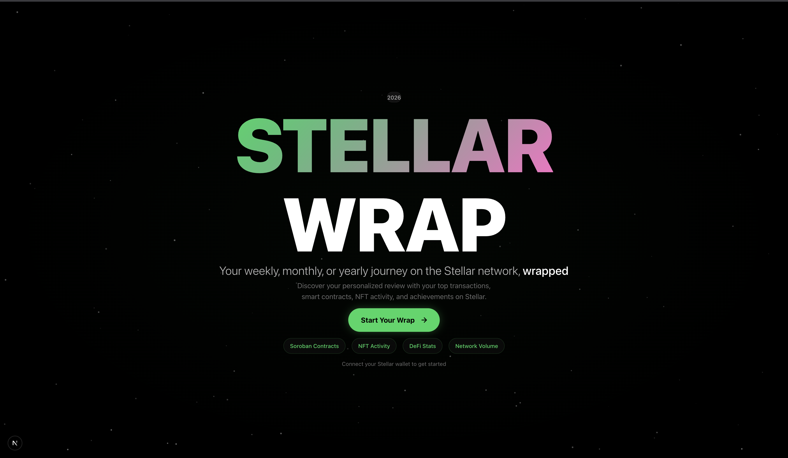
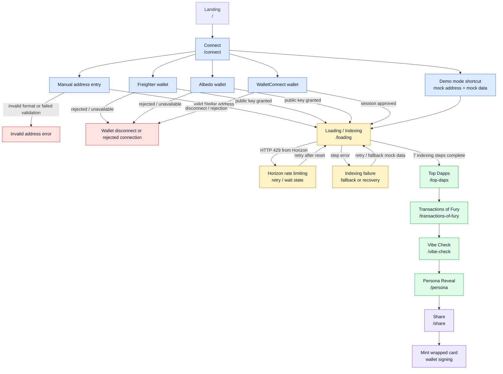
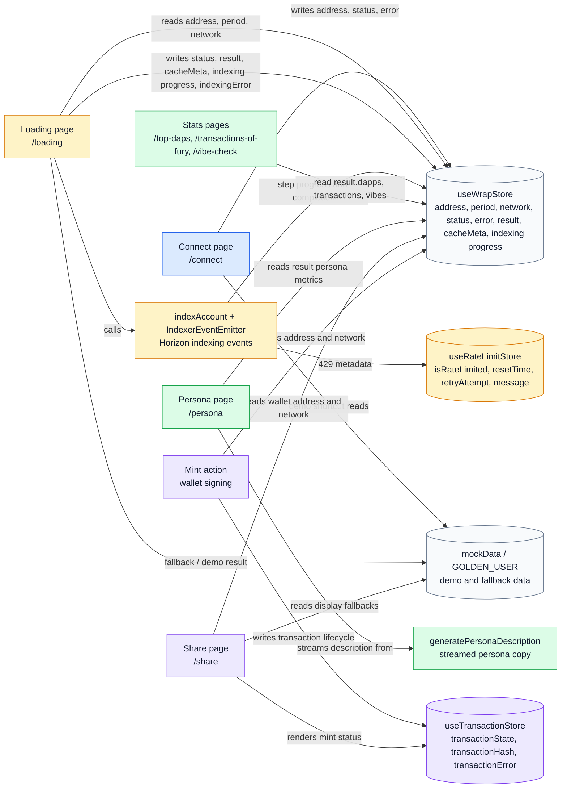
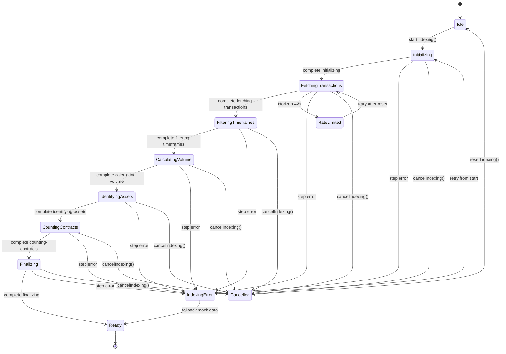

# Stellar Wrap  🎨✨

> **Turn your ledger data into social proof. A shareable, monthly summary of your impact on the Stellar network.**


[](https://github.com/zintarh/stellar-wrap-frontend/actions/workflows/lighthouse.yml)

---

## 📖 What is Stellar Wrap?

Stellar Wrap is a "Spotify Wrapped"-style experience built specifically for the Stellar community.

Block explorers are great for data, but terrible for stories. Stellar Wrap takes your raw, complex on-chain history—transactions, smart contract deployments, NFT buys—and transforms it into a beautiful, personalized visual story that anyone can understand and share.

By simply connecting your wallet, you get a dynamic snapshot of your month on Stellar, highlighting your achievements and assigning you a unique on-chain persona based on your activity.

**It’s more than just stats; it’s a tool for builders to prove their contributions and for users to flex their participation in the Stellar ecosystem.**

---

## 💡 Why We Need This

In Web3, your on-chain history is your resume, your identity, and your reputation. But right now, that reputation is hidden behind confusing transaction hashes.

**Stellar Wrap solves the visibility gap:**

* **For Builders & Developers:** It's hard to showcase the immense value of deploying open-source Soroban contracts. Stellar Wrap makes their code contributions visible and shareable to non-technical users.
* **For the Community:** We lack easy, viral loops to share excitement about what’s happening on Stellar. This tool gives everyone a reason to post about their on-chain life on social media.
* **For Users:** It turns isolated transactions into a sense of progress and belonging within the ecosystem.

---

## 🚀 How It Works

1.  **Connect:** Connect your Stellar wallet (e.g., Freighter, xBull) to our web app.
2.  **Analyze:** Our backend crunches your on-chain history for the month, pulling data on payments, DEX trades, Soroban interactions, and NFTs.
3.  **Visualize:** The frontend presents this data as a slick, animated story, highlighting your key stats.
4.  **Persona:** Based on your specific behavior, you get assigned a fun archetype (e.g., *"The Soroban Architect," "The DeFi Patron," "The Diamond Hand"*).
5.  **Share:** Generate a beautiful, branded image card ready for one-click sharing to X (Twitter), Farcaster, etc.

---

## User Journey Diagrams

These Mermaid diagrams are intentionally GitHub-compatible so new contributors can preview the full app journey directly in the README.

### User Flow



### Data Flow



### Indexing State Machine



---

## 🎯 Key Metrics Tracked

We look beyond simple payments to capture the full spectrum of Stellar's vibrant ecosystem:

* **🧙‍♂️ Soroban Builder Stats:** Contracts deployed and unique user interactions. (Critical for developer reputation!).
* **🤝 dApp Interactions:** Which ecosystem projects did you support the most?
* **🎨 NFT Activity:** New mints collected and top creators supported.
* **💸 Network Volume:** A summary of your general transaction activity.
* **🏆 Your Monthly Persona:** A gamified badge that reflects your unique contribution style.

---

## 🌟 Ecosystem Impact

This project is designed to support the growth of the Stellar network by:

1.  **Incentivizing Building:** Publicly celebrating developers who ship code creates positive reinforcement. A "Soroban Architect" badge is a social flex that encourages more building.
2.  **Driving Viral Activity:** Every shared Stellar Wrap card is organic marketing for the blockchain, showing the world that Stellar is active and being used.
3.  **Increasing Retention:** Giving users a personalized summary fosters a sense of ownership and encourages them to come back next month to beat their stats.

---

## 🛠️ Tech Stack

* **Frontend:** Next.js, React, TailwindCSS
* **Animations:** Framer Motion
* **Wallet Connection:** Stellar SDK, Freighter integration
* **Image Generation:** `satori` / `html2canvas` for creating shareable social cards.

---

## ⚙️ Configuration

### Prerequisites

- **Node.js** >= 18.0.0
- **pnpm** >= 9.0.0

### Install pnpm globally

```bash
npm install -g pnpm@9
```

### Environment variables

Copy `.env.example` to `.env.local` and set:

| Variable | Description |
|----------|-------------|
| `NEXT_PUBLIC_CONTRACT_ADDRESS_MAINNET` | Soroban contract address on mainnet (56-char, `C...`). |
| `NEXT_PUBLIC_CONTRACT_ADDRESS_TESTNET` | Soroban contract address on testnet (56-char, `C...`). |
| `NEXT_PUBLIC_CONTRACT_ADDRESS` | (Optional) Legacy: used for both networks if the two above are not set. |
| `NEXT_PUBLIC_WALLETCONNECT_PROJECT_ID` | WalletConnect project ID (optional). |

Contract addresses are loaded per network; the app uses the selected network (mainnet/testnet) to choose the contract. When you switch networks in the UI, the contract instance is re-loaded for the new network.

```markdown
### Running tests

**Unit & Integration Tests:**

```bash
pnpm install
pnpm test
```

If you see `Cannot find module 'ansi-styles'` when running `pnpm test`, run a clean install:

```bash
rm -rf node_modules && pnpm install
pnpm test
```

**End-to-End (E2E) Tests with Playwright:**

Run the full user journey (landing → connect → loading → persona → share):

```bash
# Run e2e tests headlessly
pnpm e2e

# Run with interactive UI (recommended for development)
pnpm e2e:ui
```

Tests mock the Horizon API and validate:
- Manual wallet address entry
- Wallet connection (Freighter/Albedo)
- Loading/indexing progress
- Persona reveal animation
- Share card download

E2E tests run automatically in CI on pull requests and push to main.

---

See [TESTING.md](./TESTING.md) for full Lighthouse CI documentation, score thresholds, and troubleshooting.

## 🗺️ Roadmap

Our immediate focus is on delivering a polished MVP for the community:

* ✅ Seamless wallet integration (Freighter/Albedo).
* ✅ Core data fetching and aggregation logic for a 30-day period.
* ✅ Developing the persona assignment algorithm.
* ✅ Building the dynamic social media card generator.
* ✅ Live public release for community testing.

---

## 🧾 Commit / CL format

Use a Conventional Commit–style format for all change lists (CLs) in this repo:

```text
<type>(<scope>): <short summary in present tense>

[optional body]

[optional footer(s)]
```

### Types

- **feat**: new user-facing feature (UI, flow, interaction)
- **fix**: bug fix (visual, logic, or integration)
- **refactor**: code refactor that doesn’t change behavior
- **style**: purely visual changes (spacing, colors, typography) with no behavior change
- **chore**: tooling, configs, dependency bumps, project plumbing
- **docs**: documentation only (README, comments)
- **test**: adding or updating tests only

### Scopes (suggested)

Use a small, descriptive scope in parentheses to indicate the area you touched. Examples for this project:

- **landing**: landing hero, CTA (`LandingPage`, `page.tsx`)
- **connect**: `/connect` page and wallet flow
- **loading**: `/loading` page and wrap animation
- **vibe-check**: `/vibe-check` page, vibes visualization
- **persona**: `/persona` archetype reveal
- **share**: `/share` page, share card and menus
- **store**: Zustand stores (`wrapStore`, etc.)
- **theme**: `globals.css`, Tailwind theme tokens
- **layout**: `app/layout.tsx`, root shell and providers
- **utils**: helpers like `walletConnect.ts`

If a scope doesn’t fit, you can omit it: `feat: add keyboard shortcuts`.

### Examples

- **Single-file feature**

```text
feat(landing): add weekly/monthly/yearly period selector
```

- **Cross-page flow change**

```text
feat(flow): wire connect -> loading -> persona with wrap store
```

- **Bug fix**

```text
fix(connect): show error when Freighter is missing instead of hanging
```

- **Visual tweak**

```text
style(persona): align oracle heading with progress indicator
```

- **Tooling / config**

```text
chore(store): introduce canonical wrap store for frontend data
```

### Body and footers (optional)

Use the body to add context when needed:

```text
feat(share): use canonical wrap data in share card

- read wrap data from useWrapStore
- keep mockData only in loading for now
```

For breaking changes or references:

```text
feat(store): consolidate state into wrapStore

BREAKING CHANGE: legacy store exports removed; update imports to useWrapStore.
```
